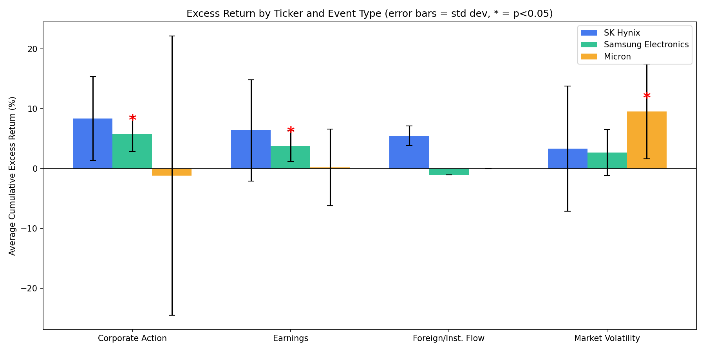

# Semiconductor Event Study

## Research Question
Which types of market events (corporate actions, earnings 
announcements, foreign/institutional flow, market volatility) generate 
statistically significant excess returns? — and does this pattern differ 
across a domestic peer (Samsung Electronics/SK Hynix) and an international peer 
(Micron) in the same industry?

- **Tickers:** SK Hynix (000660), Samsung Electronics (005930), 
  Micron Technology (MU)
- **Period:** Jan 2025 – Jul 2026
- **Event log:** 64 manually researched events across 4 categories 
  (corporate action, earnings, foreign/institutional flow, market 
  volatility), each with a cited news source (data/raw/event_log.csv)
  
- **Data sources:** FinanceDataReader (daily OHLCV, KOSPI, NASDAQ Composite)
- **Database:** SQLite with a normalized schema (daily_price, 
  benchmark_price, ticker_benchmark_map, events)
- **Excess return:** stock return minus the return of the appropriate 
  benchmark (KOSPI for Korean tickers, NASDAQ Composite for Micron), 
  matched via a ticker-benchmark mapping table
- **Statistical test:** one-sample t-test
    (H0: mean cumulative excess return over a ±3 trading day window = 0)

## Key Findings

1. **Corporate actions and earnings announcements produced statistically 
   significant excess returns for Samsung Electronics**
   (corporate action: +5.85%, p=0.0003; earnings: +3.79%, p=0.016),
   but not for SK Hynix,  despite SK Hynix showing a *higher* raw average (+8.37% for corporate actions)
   The difference is explained by SK Hynix's much larger standard deviation, illustrating why raw averages alone can be misleading.

2. **Micron showed the opposite pattern**: corporate actions and earnings 
   were statistically indistinguishable from zero, while market volatility 
   events produced a significant excess return (+9.56%, p=0.031).

3. This suggests that the type of event that moves a stock may differ 
   by market — Korean-listed semiconductor stocks appeared more sensitive 
   to firm-specific corporate actions, while the US-listed peer appeared 
   more reactive to broad volatility events.
   
## Limitations
- **Multiple comparisons**: 11 t-tests were run without correction, which increases the chance of false positives. Results should be read as exploratory rather than confirmatory.
- **Small samples for some categories** (e.g., n=1 for Samsung's 
  foreign/institutional flow events) meant a handful of groups couldn't 
  be tested for significance at all.
- **Correlation, not causation**: a significant excess return around an 
  event date does not prove the event caused the price movement. 
  Confounding news on the same day cannot be fully ruled out.
## Tech Stack
Python (pandas, scipy, matplotlib) · SQLite · SQL (window functions, 
multi-table joins) · FinanceDataReader · Jupyter

## How to Reproduce
\`\`\`bash
git clone https://github.com/HamSeowon/semiconductor_event_study.git

cd semiconductor_event_study

pip install -r requirements.txt

python3 src/collect_data.py

python3 src/build_db.py

then run notebooks/04_analysis_again.ipynb

\`\`\`
